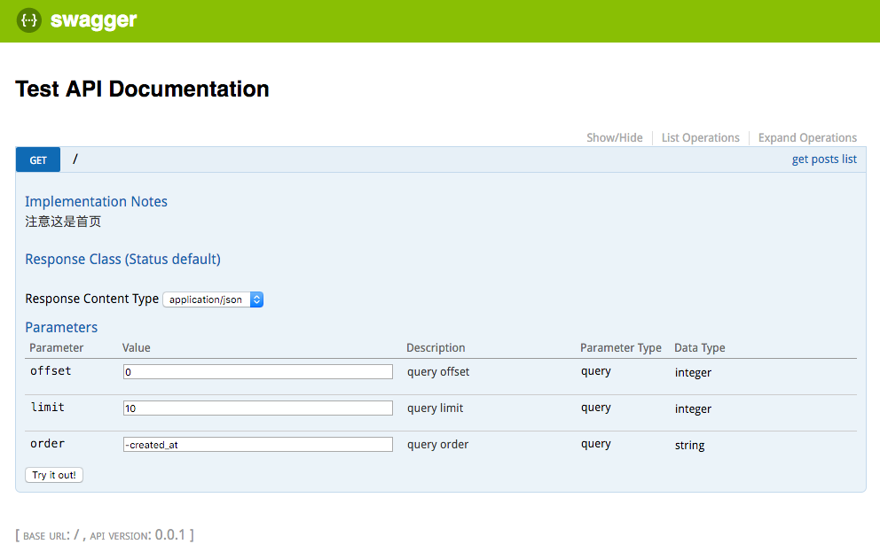

#hapi在国内用的不多,我来稍微安利一下（don't worry, be hapi)

hapi.js(读音是应该是happy js~~)是由walmart(沃尔玛) 技术团队开发的web框架，在 black friday的抢购服务中，表现优异,根据[核心团队的回答](https://github.com/hapijs/hapi/issues/1326),使用了10 CPU cores 和28GB内存，比较轻松的抗住了Black Friday的流量。
另外现在`npmjs.org`是使用hapi.js开发，项目链接[https://github.com/npm/newww](https://github.com/npm/newww),是极好的实战参考

说得nodejs的web框架，当然要提一下`express`,两者的对比，可以看下这篇[stackoverflow上的帖子](http://stackoverflow.com/questions/30469767/how-do-express-and-hapi-compare-to-each-other)不过，下面的回答多少有点利益相关，大家自己判别吧。

其实，我最后决定用hapi，原因很简单：用hapi写api时，有种代码既文档的感觉，而且这些代码也真的可以自动生成`swagger`文档。

维护`swagger`文档是比较头疼的事，用`swagger-editor`写，文档代码分离，很蛋疼。
同事写了一个解析注释的工具，思路是用`acorn`解析文件的注释，生成swagger的json。代码文档在一起了，但是写注释的负担也很重，注释的行数都在30行以上,可读性也一般,比如下面这样...

		
    /**
         @swagger
         /posts:
           get:
             summary: Get post list
             tags:
               - Posts
             parameters:
               - name: offset
                 in: query
                 description: Query offset
                 required: false
                 type: integer
                 minimum: 0
                 default: 0
               - name: limit
                 in: query
                 description: Query limit
                 required: false
                 type: integer
                 default: 10
               - name: order
                 in: query
                 description: Query order
                 required: false
                 type: string
                 default: -created_at
                 enum:
                   - -created_at
                   - created_at
                   - id
                   - -id
             responses:
               200:
                 schema:
                   ...略复杂，不写了
         @throws {ResourceNotFoundException} When post not exist
    */
        
        
 恭喜你滚动到了这里。。
 
 而使用hapi来写，是这样的
 
 ```javascript
 
    config:{
        description:'get posts list', notes:'注意这是首页',
        tags:['api'],//写上这句,开启生成swagger功能
        validate:{
            query:{
                offset : joi.number().integer().min(0).default(0).description('query offset'),
                limit: joi.number().integer().default(10).description('query limit'),
                order:joi.string().default('-created_at').description('query order')
            },
            //payload,path params
        },
        response: {schema: responseModel},//responseModel 是由joi.object()构造出来的schema
        auth:false
    }
 ```       
 
 上面的代码，其实就是配置，感觉在写文档,可读性很好。另外参数校验会自动生效，比如 offset 传入`-1`,因为最小为0，所以会返回一个描述错误的json。
 这些配置项配合一个hapi的插件[hapi-swagger](https://github.com/glennjones/hapi-swagger),简单配置下插件，swagger文档就自动生成了。
 
 代码文档分离的问题解决了，而且还附带了检验功能，可读性还那么好。当我把demo做完，也不用和express做比较了，团队其他成员看了，也表示太舒服了（♂），想要一试。
 
 写个简单的例子吧。
 
 ## 首先是配置server
 	
 	
```javascript

    const fs = require('fs')
    const path = require('path')
    const Hapi = require('hapi')
    const joi = require('joi')
    const Inert = require('inert')
    const Vision = require('vision')
    const HapiSwagger = require('hapi-swagger')
    
    const HapiAsyncHandler = require('hapi-async-handler')
    const Promise = require('bluebird')
    const readFile = Promise.promisify(fs.readFile)
    const internals = {
        servers: {
            port: 3333,
            host: 'localhost'
        }
    }
    
    const server = new Hapi.Server({})
    server.connection(internals.servers)
    
    const SwaggerOptions = {
        info: {
            'title': 'Test API Documentation',
            'version': '0.0.1'
        }
    };
    
    server.register([
            Inert,
            Vision,
            HapiAsyncHandler,
            {
                'register': HapiSwagger,
                'options': SwaggerOptions
            }], (err) => {
            if (err) throw new Error('')
        }
    );
``` 
	
大部分都是大白话,`server.register`是注册需要的插件（plugins）.找插件是搭架子时候的一个主要工作,如果决定用hapi,又要负责搭建server的基础设施,熟悉各种常用的插件,是必须的.

找插件的话,首先去hapijs团队的[github](https://github.com/hapijs)上找.建议把里面的每个工程都点进去看下readme,然后会发现核心团队已经把工程各个方面需要的插件,基本都考虑了.

这其实也反映了hapi生态环境的特点: 丰富性和express比,差距不小,但是核心团队自己开发了很多了高质量的库,涵盖了工程开发的诸多方面.
当然,现在越来越多的人加入hapi的生态中,而官方对合格的插件有比较严格的要求,test coverage 100%之类的.

还有官方的[plugins页](http://hapijs.com/plugins).

当然这些插件的整理,是个精细的体力活（0_0!）

这里的代码,注册了4个插件,`Hapi-Swagger`是用了生成swagger文档的,`Inert`和`Vision`是它的依赖,用来serve静态文件和view的.

HapiAsyncHandler在这里是为了装逼使用async/await（我好诚实..),个人觉得通过babel,使用async/await已经没啥问题了,注意下错误处理就可以了.
这里直接使用一个官方认可的插件.如果要在express里用,可以看下[这篇文章'](https://strongloop.com/strongblog/async-error-handling-expressjs-es7-promises-generators/)

##然后写api

```javascript

    server.route({
        method: 'get',
        path: '/',
        config: {
            description: 'get posts list', notes: '注意这是首页',
            tags: ['api'],
            validate: {
                query: {
                    offset: joi.number().integer().min(0).default(0).description('query offset'),
                    limit: joi.number().integer().default(10).description('query limit'),
                    order: joi.string().default('-created_at').description('query order')
                }
                //payload,path params
            }
            //response: {schema: responseModel},//responseModel 是joi.object()构造出来的
        },
        handler: {
            async: async function (req, reply) {
                const text = await readFile(path.join(__dirname, './foo.txt'), 'utf-8');
                reply(text)
            }
        }
    })
```

搭好架子后,大部分的开发工作都是在写router,这里因为简单演示,handler就直接写了.复杂的项目,可以去参考`npmjs.org`的项目代码.

主体代码就这些,运行,打开 http://localhost:3333/documentation 结果看图


    
随便改变下参数,比如offset 设成-1,接口会返回
    
    {
      "statusCode": 400,
      "error": "Bad Request",
      "message": "child \"offset\" fails because [\"offset\" must be larger than or equal to 0]",
      "validation": {
        "source": "query",
        "keys": [
          "offset"
        ]
      }
    }

#总结

hapi的特点还是比较鲜明的

1. 以配置为核心.代码可读性很好,不过有时配置太多,记忆负担有点重,做好代码的管理,以备以后copy paste

2. 以request生命周期的各种拓展点（extension points）来纵向拓展server的功能,大部分的插件都是基于这些ext points.这和express的中间件机制很不一样.

3. server在缓存,验证,监控管理等方面都有考虑,配合官方的插件,算得上是 battery ready的框架.

这些是一些人喜欢的,也是一些人讨厌的.如果看着觉得还不错,可以考虑下hapi,祝您玩的hapi